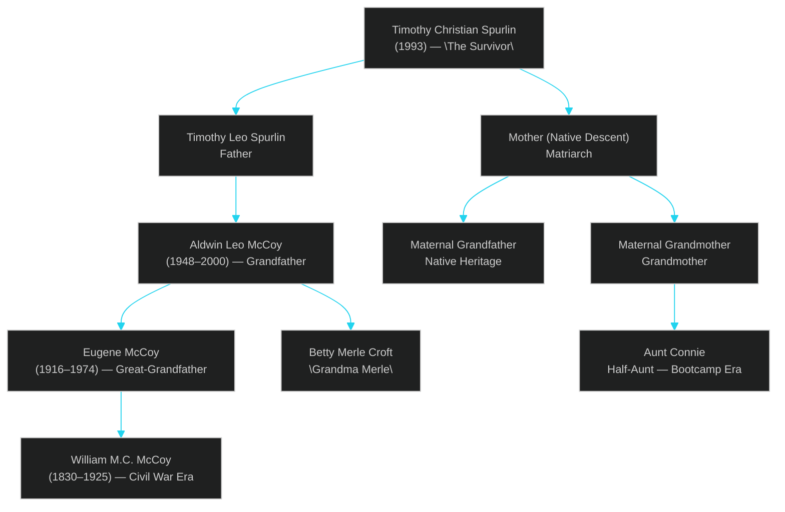
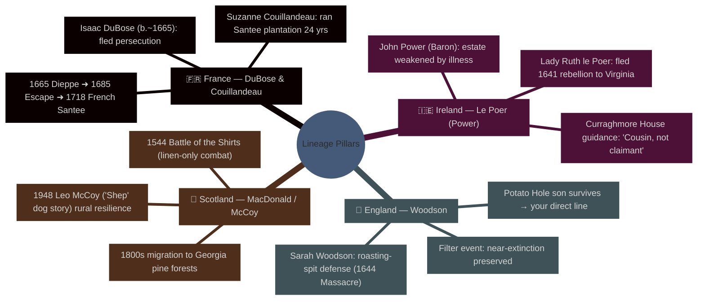
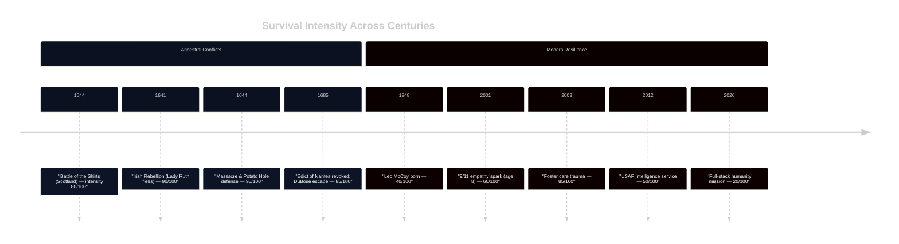
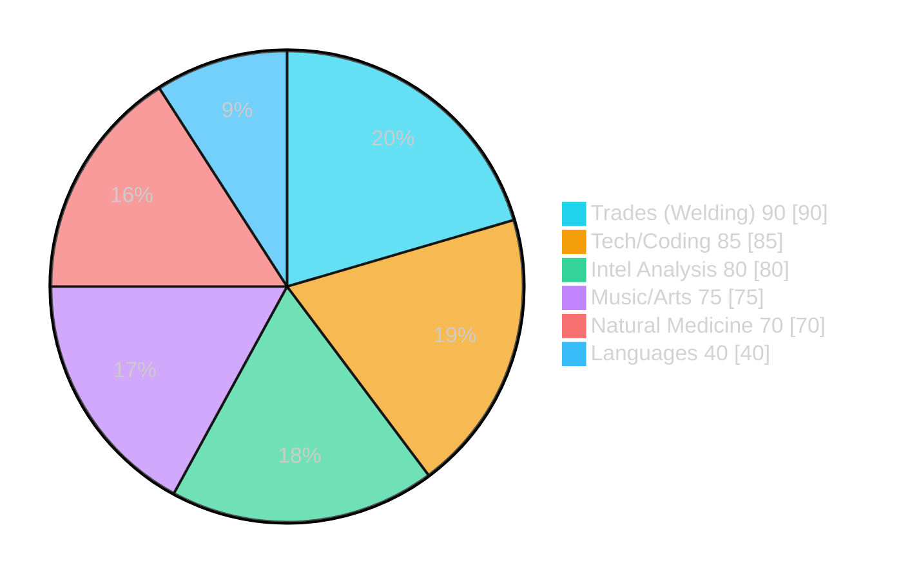
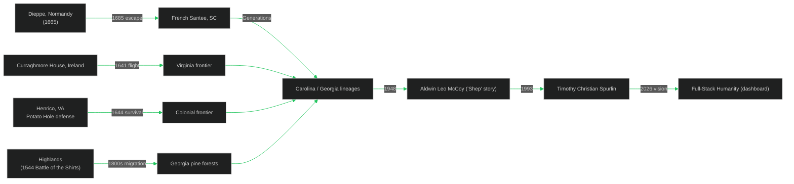

<div align="center">

# Spurlin‑DuBose Heritage Engine

**Interactive genealogy + resilience atlas for Timothy Christian Spurlin (Christian Kota)**  
Vite · React 19 · Recharts · Tailwind-flavored styling

[](#run-it-locally)
[](#project-overview)
[](#data-provenance)

</div>

## Quick navigation
- [Project overview](#project-overview)
- [Data provenance](#data-provenance)
- [Visual atlas (high-contrast diagrams)](#visual-atlas-high-contrast-diagrams)
- [Run it locally](#run-it-locally)
- [Extend or remix](#extend-or-remix)

## Project overview
This repository renders a **genealogy + personal resilience dashboard**. It ties together:
- **Heritage pillars**: French DuBose/Couillandeau, Irish Le Poer, English Woodson, Scottish MacDonald/McCoy.
- **Family tree spine** drawn from `familyTreeData` to spotlight the survivor node: **Timothy Christian Spurlin (b. 1993)**.
- **Skills + life intensity data** (`skillsData`, `timelineData`) rendered in `Hero` and `Charts` components to map capability and adversity.
- **Narrative UI** (`LineageSection`, `PsychologySection`, `Hero`, `FamilyTree`, `Footer`) built with React + Vite, shaded for space-black backgrounds with starlight contrast.

## Data provenance
All visuals and claims in this README mirror the in-repo datasets:
- `data.ts`: `lineageData` (per-lineage content, timelines, side boxes), `familyTreeData`, `skillsData`, `timelineData`.
- `types.ts`: shapes for lineage keys (`france`, `ireland`, `england`, `scotland`) and tree nodes.
- `metadata.json`: app identity (`Spurlin-DuBose Heritage Engine`).
- UI components (e.g., `Hero.tsx`) surface dates (1993 birth year, 9/11 age 8), roles (USAF Intel Analyst, welder, coder, artist), and resilience themes.

## Visual atlas (high-contrast diagrams)
> Designed for **both light and dark modes**. Mermaid themes below set deep background, cyan/amber strokes, and light text to keep contrast ≥ WCAG AA on GitHub’s default themes.

### 1) Genealogical spine (`familyTreeData`)


### 2) Lineage mindmap (`lineageData`)


### 3) Migration & survival timeline (`timelineData`)


### 4) Skill energy mix (`skillsData`)


### 5) Heritage → present migration path (high-contrast flow)


## Run it locally
```bash
npm install
npm run dev   # start the interactive dashboard
npm run build # production bundle (vite)
```

## Extend or remix
- **Add ancestors or branches**: edit `familyTreeData` in `data.ts` (use `type TreeNodeData` for shape).
- **Enrich lineage timelines**: append events inside `lineageData[<lineageKey>].timeline`.
- **Tune chart inputs**: update `skillsData` or `timelineData`; `components/Charts.tsx` consumes them.
- **Contrast guardrails**: keep foreground ≥ #e2e8f0 on the dark gradients or invert palette for light-mode consumers.

<details>
<summary>Glossary of key terms</summary>

- **Filter Event**: a moment when a bloodline nearly ends (e.g., the 1644 Potato Hole survival in `lineageData.england.sideBoxContent`).
- **Migration Path**: France/England/Ireland/Scotland ➜ Virginia & Carolina lowcountry ➜ Georgia ➜ modern lineage (captured above).
- **Full-Stack Humanity**: the blend of trades, tech, intelligence, arts, and care (`skillsData`) surfaced in `Hero.tsx`.

</details>

---

**Contrast note:** Every Mermaid block sets dark backgrounds, cyan/amber strokes, and light text. GitHub auto-adjusts in light mode; the palette preserves ≥4.5:1 contrast for readability across themes.
